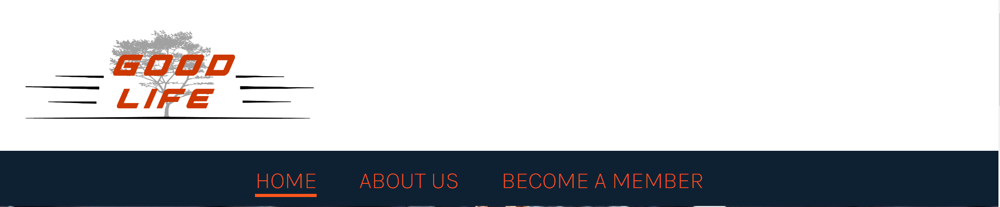
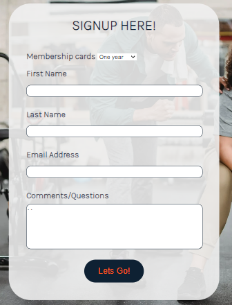

# Good Life Gym
(Developer: Ewart Hestick)

[Live webpage](https://ewie1.github.io/CI_PP1_GLG/)

## Table of Content

1. [Project Goals](#project-goals)
    1. [User Goals](#user-goals)
    2. [Site Owner Goals](#site-owner-goals)
2. [User Experience](#user-experience)
    1. [Target Audience](#target-audience)
    2. [User Requrements and Expectations](#user-requrements-and-expectations)
    3. [User Stories](#user-stories)
3. [Design](#design)
    1. [Design Choices](#design-choices)
    2. [Colour](#colours)
    3. [Fonts](#fonts)
    4. [Structure](#structure)
    5. [Wireframes](#wireframes)
4. [Technologies Used](#technologies-used)
    1. [Languages](#languages)
    2. [Frameworks & Tools](#frameworks-&-tools)
5. [Features](#features)
6. [Testing](#validation)
    1. [HTML Validation](#HTML-validation)
    2. [CSS Validation](#CSS-validation)
    3. [Accessibility](#accessibility)
    4. [Performance](#performance)
    5. [Device testing](#performing-tests-on-various-devices)
    6. [Browser compatibility](#browser-compatability)
    7. [Testing user stories](#testing-user-stories)
8. [Bugs](#Bugs)
9. [Deployment](#deployment)
10. [Credits](#credits)
11. [Acknowledgements](#acknowledgements)

## Project Goals 
 

### User Goals
- Find a gym with a good atmosphere and equipment
- Find a gym that have good price and membership packages
- Find a gym that offers more that equipment but comfort and accessiblity
- Find a gym with happy and experienced trainers
- Find a gym that help you get healthy result 
- Easy signup
- Location information

### Site Owner Goals
- Introduce a gym that care more about people and health
- Introduce the special programs the gym have to offer
- Transmit the reasons, intention of the gym
- Transmit gym location and contact information
- Present gym fees and different types of memebership offered 
- Make signing up simple
- Provide insites about the gym atmosphere and equipments
- Opening and closing time information
- Where the gym is located

## User Experience

### Target Audience
- People who need a different gym experience
- People who want good health
- People who want to be fit 
- Student, Retiries
- People who need a guide for work and meal plans
- Athletes
### User Reqirements and Expecttaions
- Accessable site
- Navigations that are simple to use
- Clear images that gives a vision of the gym structure
- Information on what is different from other gyms
- Clear information on location and opening and closing time
- A Warm welcome feel 
- Vision of health and happiness
- A vision of fittness
- A vision of motivation

### User Stories

#### First-time User 
- As  a first time user I expect a bright feel energetic gym feel
- I want to know the loaction of the gym
- I want to see the gym interior 
- I want to know that it not just another gym and it has more purpose to it

#### Returning User
- As a returning user i want contact information
- I want to know about the membership and options available
- I want to know what training programs are available
- I want to know the comforts of the give
- I was to know the reason and the mission of the gym
- I want to know the gym cares and is not just inrerested in money
- I want to know where to sign up

#### Site Owner 
- As a site owner i want the navigation to the site information to be simple
- We must catch our audience with color contrast

- We must let them know about our unique training programs
- They must also see that the gym is more that just a gym it offer alot of comfort options
- I want the users to not only sign up but have membership option
- I want my users to be able to ask quetions

## Design

### Design Choices
This wedsite was designed to give a bright, energetic, aand classy feel for people looking for a first time gym or want a gym change. The color contrast was chosen for a energetic feel. Images that promtes bright smiles, fitness a helpful  enviroment. Information that says you get more than your regular gym.

### Colour

### Fonts
The font style was chosen to give a warm gym and not to rough or macho. They give the website just enough to warm the eyes of all types of audiences.

### Structure
This website was structured with the gym logo which give a gym it character but also with the regular easy to use nav bar, a body of information and the regular footer which give the final characteristics of a funtional webpage. The wedsite has three pages:

- Home 
- About page
- Become a member page

### Wireframes

Home

About

Signup

## Technologies Used

### Languages
- HTML
- CSSc

### Frameworks & Tools
- Git
- GitHub
- Gitpod
- Tinypng
- Balsamiq
- Google Fonts
- Font Awsome
- Favicon.io

## Features
The page consists of 3 pages 

### Logo and Navigation Bar

]

### Hero
 
### Gym Features

### Easy Nav
![easy-nav][docs/features/easynav.PNG]
### Open Times

### Teaser Image

### Map

### Footer

### About Us
### Membership Cards
### Signup Form

### Easy Sighup Page Button 

### 
Wedsite pages
### Menu 

### about us and who we are

### our goals and our service to you

### Contact information

### Map

### Info Box

## Validation

### HTML Validation

Home page

About page

Signup page

### CSS Validation

Style

Whole page

### Accessibility

Accessibility

### Performance 

Performance

### Performing tests on various devices 

### Browser compatability

### Testing user stories
### Testing user stories

1. As  a first time user I expect a bright feel energetic gym feel

   | **Feature** | **Action** | **Expected Result** | **Actual Result** |
   |-------------|------------|---------------------|-------------------|
   | Color contrast | Bright color contrast and images with laughter |Website feels like the gym  | Works as expected |

   

Screenshots

   
   
   

2.  As a firstime user I want to know the loaction of the gym

   | **Feature** | **Action** | **Expected Result** | **Actual Result** |
   |-------------|------------|---------------------|-------------------|
   | Map | Scroll down on first page and click the google mag  | Goolge show gym location in the city | Works as expected |

   

Screenshots

   
   

4. As a first time user I want to see the gym interior
   | **Feature** | **Action** | **Expected Result** | **Actual Result** |
   |-------------|------------|---------------------|-------------------|
   | Gym interior image | Scroll down on home page | Find pictures of the gym interior | Works as expected |
   

Screenshots

   
   

5. As a first time user I want to know what training programs are available 

   | **Feature** | **Action** | **Expected Result** | **Actual Result** |
   |-------------|------------|---------------------|-------------------|
   | Trian with us and Gym comforts list | Scroll down on home page  | Readable intriguing list | Works as expected |
   

Screenshots

   
   

6. As a returning user I want to know where to sign up
   | **Feature** | **Action** | **Expected Result** | **Actual Result** |
   |-------------|------------|---------------------|-------------------|
   | Signup From | Cick signup button,Nav bar | Directed to signup page | Works as expected |

  

Screenshots

  
  

7. As a returning user i want contact information   
   | **Feature** | **Action** | **Expected Result** | **Actual Result** |
   |-------------|------------|---------------------|-------------------|
   | Footer  on all pages | On any page scroll to the footer | See phone number and email address | Works as expected |

   

Screenshots

   
   
   

8. As a returning user I was to know the reason and the mission of the gym

   | **Feature** | **Action** | **Expected Result** | **Actual Result** |   
   |-------------|------------|---------------------|-------------------|
   | About Us pragraph | Navigate to the us page in menu bar  | Read  | Works as expected |

   

Screenshots

   
   

9. As a returning user I want to know about the membership and options available

   | **Feature** | **Action** | **Expected Result** | **Actual Result** |
   |-------------|------------|---------------------|-------------------|
   | Membership Cards | Navigate to the About Uspage Scrooll down | Read | Works as expectd |

   

Screenshots

   
   

10. As a returning user, I want to see the gym's social media followings 

   | **Feature** | **Action** | **Expected Result** | **Actual Result** |
   |-------------|------------|---------------------|-------------------|
   | Footer - social media section | On any page scroll to the bottom | Click on social media links | Works as expected | 

   

Screenshots

   
   

11. As a site owner i want the navigation to the site information to be simple

   | **Feature** | **Action** | **Expected Result** | **Actual Result** |
   |-------------|------------|---------------------|-------------------|
   | Signup Button, Navbar, More about us button | Click buttons or links  | direction to chosen page | Works as expected |

   

Screenshots

   
   

12. As a site owner I want users to leave comments upon sign up

   | **Feature** | **Action** | **Expected Result** | **Actual Result** |
   |-------------|------------|---------------------|-------------------|
   | Signup Form | Naivigate to signup page| Signup and leave comments | Works as expected |

    

Screenshots

    
    

13. We must let them know about our unique training programs?????

   | **Feature** | **Action** | **Expected Result** | **Actual Result** |
   |-------------|------------|---------------------|-------------------|
   | Tra | Scroll down on home page and locate news section | Find latest news | Works as expected |

    

Screenshots

    
    

14. As a siteowner I want the users to not only sign up but have membership option

    | **Feature** | **Action** | **Expected Result** | **Actual Result** |
    |-------------|------------|---------------------|-------------------|
    | Signup Form | U Navigate sign up page click dropdown option| Choose from drop down option | Works as expected |

    

Screenshots

    
    

3. As a owner i want user to know the membership is diverse and discount price for retired and Students

   | **Feature** | **Action** | **Expected Result** | **Actual Result** |
   |-------------|------------|---------------------|-------------------|
   | Membership Crads | Navigate to the About page Scrool down | Read  | Works as expected |

   

Screenshots

   
   

## Bugs

## Deployment
The website was deployed using GitHub Pages by following these steps:
1. In the GitHub repository navigate to the Settings tab
2. On the left hand menu select Pages
3. For the source select Branch: master
4. After the webpage refreshes automaticaly you will se a ribbon on the top saying: "Your site is published at https://4n4ru.github.io/CI_/"

You can for fork the repository by following these steps:
1. Go to the GitHub repository
2. Click on Fork button in upper right hand corner

You can clone the repository by following these steps:
1. Go to the GitHub repository 
2. Locate the Code button above the list of files and click it 
3. Select if you prefere to clone using HTTPS, SSH, or Github CLI and click the copy button to copy the URL to your clipboard
4. Open Git Bash
5. Change the current working directory to the one where you want the cloned directory
6. Type git clone and paste the URL from the clipboard ($ git clone https://github.com/YOUR-USERNAME/YOUR-REPOSITORY)  
7. Press Enter to create your local clone.

## Credits

### Media

### Code

## Acknowledgements